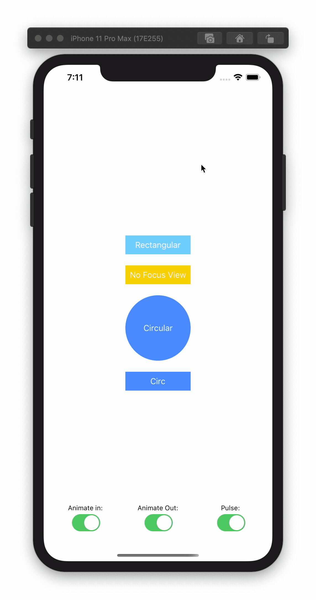

# PRGTipView

[](https://cocoapods.org/pods/PRGTipView)
[](https://cocoapods.org/pods/PRGTipView)
[](https://cocoapods.org/pods/PRGTipView)


PRGTipView is a drop-in solution for adding onboarding tips to your apps. It supports:
- Title, detail and dismissal button
- Give focus on a particular view with configurable insets
- Automatic placement of title, detail and the button above or below the focused view (if provided)
- Presentation and dismissal animations
- Focus view pulsating effect (using the [Pulsar](https://github.com/regexident/Pulsar) Library)



## Example

To run the example project, clone the repo, and run `pod install` from the Example directory first.

## Requirements

- iOS 10+
- Swift 5

## Installation

PRGTipView is available through [CocoaPods](https://cocoapods.org). To install
it, simply add the following line to your Podfile:

```ruby
pod 'PRGTipView'
```

## Usage


```swift
    //1. Create a PRGTipViewConfiguration instance
    let config = PRGTipViewConfiguration()

    //2. Customize the TipView via the properties
    config.titleText = "This is a title"
    config.detailText = "This is the detail text, that adds more information to your tip."
    config.buttonText = "OK"
    config.focusView = button
    config.focusInsets = UIEdgeInsets(top: 8, left: 4, bottom: 8, right: 4)
    config.focusDistance = 50
    config.circularFocus = false
    config.animateIn = true
    config.animateOut = true

    //3a. You can either use the static func TipView.show like described below:
    PRGTipView.show(fromViewController: self, withConfiguration: config, completion: nil)
    
    //3b. Or you can create a PRGTipView instance and present it (it's a ViewController subclass)
    let tipView = PRGTipView(configuration: config)
    present(tipView, animated: false, completion: nil)
```

## Configuration Properties
PRGTipViewConfiguration contains properties that help customize the presenting tip view:

| PROPERTY             | TYPE                | DEFAULT VALUE              | EXPLANATION                                                                                                                                                                                                                                                                                                                                                                                                                                                                                                                                          |
|----------------------|---------------------|----------------------------|------------------------------------------------------------------------------------------------------------------------------------------------------------------------------------------------------------------------------------------------------------------------------------------------------------------------------------------------------------------------------------------------------------------------------------------------------------------------------------------------------------------------------------------------------|
| backgroundColor      | UIColor             | .black                     | The background color of the Tip View                                                                                                                                                                                                                                                                                                                                                                                                                                                                                                                 |
| backgroundAlpha      | CGFloat             | 0.85                       | The background alpha of the Tip View                                                                                                                                                                                                                                                                                                                                                                                                                                                                                                                 |
| tipTextYSpacing      | CGFloat             | 30                         | The vertical spacing between the Tip View Title, Detail and Button                                                                                                                                                                                                                                                                                                                                                                                                                                                                                   |
| titleText            | String?             |                            | The string to be shown as the Tip View title                                                                                                                                                                                                                                                                                                                                                                                                                                                                                                         |
| titleTextFont        | UIFont              | systemFont(ofSize: 25)     | The font of the Tip View title                                                                                                                                                                                                                                                                                                                                                                                                                                                                                                                       |
| titleTextColor       | UIColor             | .white                     | The color of the Tip View title                                                                                                                                                                                                                                                                                                                                                                                                                                                                                                                      |
| attributedTitleText  | NSAttributedString? |                            | The attributed string to be shown as the Tip View title. If set, it overrides "titleText", "titleTextFont" and "titleTextColor" properties                                                                                                                                                                                                                                                                                                                                                                                                           |
| detailText           | String?             |                            | The string to be shown as the Tip View detail                                                                                                                                                                                                                                                                                                                                                                                                                                                                                                        |
| detailTextFont       | UIFont              | systemFont(ofSize: 29)     | The font of the Tip View detail                                                                                                                                                                                                                                                                                                                                                                                                                                                                                                                      |
| detailTextColor      | UIColor             | .white                     | The color of the Tip View detail                                                                                                                                                                                                                                                                                                                                                                                                                                                                                                                     |
| attributedDetailText | NSAttributedString? |                            | The attributed string to be shown as the Tip View detail. If set, it overrides "detailText", "detailTextFont" and "detailTextColor" properties                                                                                                                                                                                                                                                                                                                                                                                                       |
| buttonText           | String?             |                            | The string to be shown as the Tip View dismissal button title                                                                                                                                                                                                                                                                                                                                                                                                                                                                                        |
| buttonTextFont       | UIFont              | boldSystemFont(ofSize: 14) | The font of the Tip View dismissal button                                                                                                                                                                                                                                                                                                                                                                                                                                                                                                            |
| buttonTextColor      | UIColor             | .white                     | The color of the Tip View dismissal button                                                                                                                                                                                                                                                                                                                                                                                                                                                                                                           |
| attributedButtonText | NSAttributedString? |                            | The attributed string to be shown as the Tip View dismissal title. If set, it overrides "buttonText", "buttonTextFont" and "buttonTextColor" properties                                                                                                                                                                                                                                                                                                                                                                                              |
| focusView            | UIView?             |                            | The UIView to be focused when the Tip View is presented                                                                                                                                                                                                                                                                                                                                                                                                                                                                                              |
| circularFocus        | Bool                | false                      | If a "focusView" is provided, this property controls whether the mask used to focus on the view should be circular. In default "false" state, the mask is rectangular                                                                                                                                                                                                                                                                                                                                                                                |
| useLargestDimension  | Bool                | true                       | If "circularFocus" is set to true for a non square "focusView", leaving this property to "true" will use the "focusView"'s largest dimension to calculate the focus mask radius, while setting it to "false" will use the smallest dimension and centre the circular mask on the "focusView".                                                                                                                                                                                                                                                        |
| focusInsets          | UIEdgeInsets        | .zero                      | Adds padding to the "focusView" mask. If "circularFocus" is set to "true", then it adds only the .top inset to the radius calculation.                                                                                                                                                                                                                                                                                                                                                                                                               |
| animateIn            | Bool                | true                       | Whether the Tip View should be presented animated. Helpful in situations where you want to chain several Tip Views and you do not want to repeat the animation on each and every one of them.                                                                                                                                                                                                                                                                                                                                                        |
| animateOut           | Bool                | true                       | Whether the Tip View should be dismissed animated. Helpful in situations where you want to chain several Tip Views and you do not want to repeat the animation on each and every one of them.                                                                                                                                                                                                                                                                                                                                                        |
| pulseMode            | Enum                | .none                      | Whether the "focusView", if provided, should pulse.                                                                                                                                                                                                                                                                                                                                                                                                                                                                                                  |
| focusDistance        | CGfloat             | 0                          | The vertical spacing between the "focusView" and the container of the actual Tip Texts (Title, Detail, Button). If the provided "focusView" is in the bottom half of the screen, the tip container is presented above it and this property is the distance from the bottom of the tip container to the top of the "focusView" mask. If the provided "focusView" is in the top half of the screen, the tip container is presented below it and this property is the distance from the top of the tip container to the bottom of the "focusView" mask. |
| tipContainerLeading  | CGFloat             | 20                         | The spacing between the container of the actual Tip Texts (Title, Detail, Button) to it's superView's leading.                                                                                                                                                                                                                                                                                                                                                                                                                                       |
| tipContainerTrailing | CGFloat             | 20                         | The spacing between the container of the actual Tip Texts (Title, Detail, Button) trailing to it's superView's trailing.                                                                                                                                                                                                                                                                                                                                                                                                                             |
| animationDuration    | Double              | 0.3                        | The duration of any animation that takes place in the Tip View (except from the pulsating effect)                                                                                                                                                                                                                                                                                                                                                                                                                                                    |


## Author

John Spiropoulos, jspiropoulos@programize.com

## License

PRGTipView is made for [Programize LLC](https://www.programize.com) by John Spiropoulos and it is available under the MIT license.

This product includes Pulsar code by Vincent Esche. License information is stored here: [LICENSE](LICENSE)

